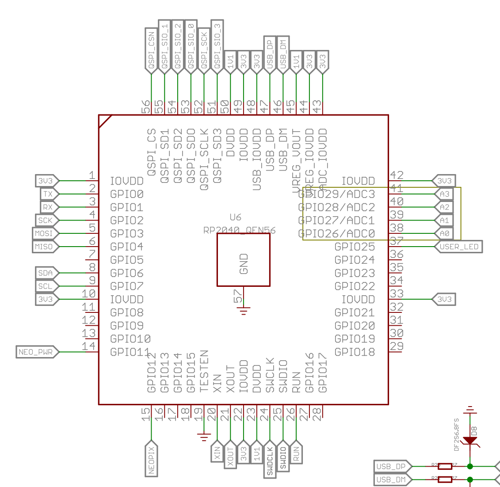

## 参考資料

### seeed xiao rp2040のピン

PRKで指定する番号がxiaoだとどうなってるのか知りたかった。

[XIAO1key は Seeed Studio XIAO PR2040 を使った1キーのキーボードです](https://kurihara.hatenadiary.jp/entry/2022/09/11/190307)では、`P2_SCK`に接続したキーをソフトウェア上で`2`としていた。

seeed studioのハードウェア紹介の掲載画像によれば

となっている。当該ブログと公式情報を統合して考えると、公式情報における灰色のライン, Micropythonと表示されているところをPRKでも参照しているのだと判断した。

更新: Micropythonの箇所での表示はおそらくGPIOの番号に対応してる。というわけで、[Switch sciense](https://www.switch-science.com/products/7634)からダウンロードしたスキーマ図が以下

予想が正しかったことがわかる。これで自信をもって進められる。
